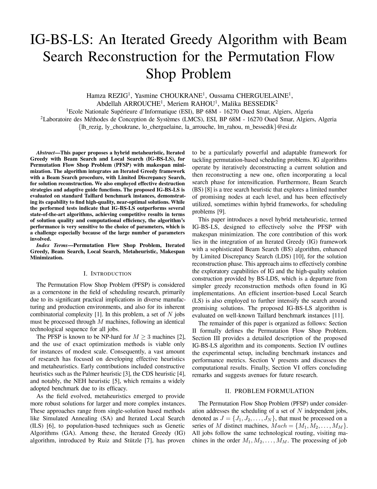

## Current Status & Performance Highlights (As of 16/05/2025)
# FSP Solver: Iterated Greedy with Beam Search Reconstruction & Local Search

## Current Status & Performance Highlights (As of 16/05/2025)

**Key Algorithmic Features & `skopt` Insights:**
*   The solver implements an Iterated Greedy (IG) framework with NEH initialization.
*   Destruction uses either **Block Removal** or a simplified **Shaw-like Removal**. `skopt` generally preferred `block` for 20x5 and 50x10 instances, but `shaw` for the first 100x10 instance.
*   Reconstruction is performed by a **standard Beam Search (BS)**, optionally enhanced with **Limited Discrepancy Search (LDS)**.
*   Guide functions for BS include `makespan_bound_fwd` and `walpha_fwd` (with adaptive alpha). `skopt` showed varied preferences depending on the instance size.
*   **Local Search (Best Insertion)** is applied to the initial NEH solution and the final best solution, proving consistently beneficial.
*   Recent `skopt` tuning explored additional parameters:
    *   `stagnation_limit`: Number of non-improving IG iterations before a potential diversification strategy (details of strategy to be documented if specific).
    *   `perturb_k_destroy_p`: Factor to dynamically vary the percentage of jobs destroyed.
    *   These parameters, along with wide beam widths, were often part of high-performing configurations.

**Performance Summary (Using `skopt`-informed parameters for each benchmark set):**

| Benchmark Set | Avg. Impr. NEH (%) | Avg. RPD from UB (%) | Notes on Parameters & Performance                                                                                                |
| :------------ | :----------------- | :------------------- | :------------------------------------------------------------------------------------------------------------------------------- |
| `tai20_5`     | 2.22%              | 0.93%                | Matched UB (0.00% RPD) on 2/10 instances (`Inst1`, `Inst10`). Strong performance for small instances. Parameters from `skopt(tai20_5_Inst1)`. |
| `tai50_10`    | 1.76%              | 2.73%                | Consistent improvement over NEH. Parameters from `skopt(tai50_10_Inst1)`. Best RPD was 1.31% (`Inst2`).                           |
| `tai100_10`   | 0.79%              | 1.36%                | Improvement on all instances. Parameters from `skopt(tai100_10_Inst1)`. Best RPD was 0.26% (`Inst6`).                           |

**Note:**
*   RPD = `((Solver_Makespan - UB_Makespan) / UB_Makespan) * 100%`.
*   Impr. over NEH = `((NEH_Makespan - Solver_Makespan) / NEH_Makespan) * 100%`.
*   Parameters used for each full benchmark run are derived from `skopt` tuning on the first instance of that benchmark size.
*   UB values are from Taillard's benchmark definitions.

--- Detailed Results Per Benchmark Set ---

**Taillard 20x5 (10 instances) - Params from `skopt(tai20_5_Inst1)`:**
*(k_p=0.37, perturb_k=0.8, beam=32, guide=walpha, LDS(2,2), dest=block, LS=True, stag=95)*

| Instance       | NEH M. | Solver M. | Impr. NEH (%) | UB   | RPD UB (%) | Time (s) |
| :------------- | :----- | :-------- | :------------ | :--- | :--------- | :------- |
| tai20_5_Inst1  | 1286   | 1278      | 0.62%         | 1278 | 0.00%      | 9.62     |
| tai20_5_Inst2  | 1365   | 1365      | 0.00%         | 1359 | 0.44%      | 9.63     |
| tai20_5_Inst3  | 1159   | 1088      | 6.13%         | 1081 | 0.65%      | 9.76     |
| tai20_5_Inst4  | 1325   | 1302      | 1.74%         | 1293 | 0.70%      | 9.64     |
| tai20_5_Inst5  | 1305   | 1258      | 3.60%         | 1236 | 1.78%      | 9.54     |
| tai20_5_Inst6  | 1228   | 1224      | 0.33%         | 1195 | 2.43%      | 9.55     |
| tai20_5_Inst7  | 1278   | 1251      | 2.11%         | 1239 | 0.97%      | 9.68     |
| tai20_5_Inst8  | 1223   | 1211      | 0.98%         | 1206 | 0.41%      | 9.63     |
| tai20_5_Inst9  | 1291   | 1253      | 2.94%         | 1230 | 1.87%      | 9.74     |
| tai20_5_Inst10 | 1151   | 1108      | 3.74%         | 1108 | 0.00%      | 9.64     |
| **Average**    |        |           | **2.22%**     |      | **0.93%**  |          |

**Taillard 50x10 (10 instances) - Params from `skopt(tai50_10_Inst1)`:**
*(k_p=0.31, perturb_k=0.45, beam=25, guide=walpha, LDS(0,6), dest=block, LS=True, stag=90)*

| Instance        | NEH M. | Solver M. | Impr. NEH (%) | UB   | RPD UB (%) | Time (s) |
| :-------------- | :----- | :-------- | :------------ | :--- | :--------- | :------- |
| tai50_10_Inst1  | 3135   | 3103      | 1.02%         | 3025 | 2.58%      | 13.28    |
| tai50_10_Inst2  | 3032   | 2930      | 3.36%         | 2892 | 1.31%      | 21.33    |
| tai50_10_Inst3  | 2986   | 2960      | 0.87%         | 2864 | 3.35%      | 11.67    |
| tai50_10_Inst4  | 3198   | 3114      | 2.63%         | 3064 | 1.63%      | 21.47    |
| tai50_10_Inst5  | 3160   | 3074      | 2.72%         | 2986 | 2.95%      | 15.91    |
| tai50_10_Inst6  | 3178   | 3169      | 0.28%         | 3006 | 5.42%      | 11.50    |
| tai50_10_Inst7  | 3277   | 3191      | 2.62%         | 3107 | 2.70%      | 15.03    |
| tai50_10_Inst8  | 3123   | 3096      | 0.86%         | 3039 | 1.88%      | 13.22    |
| tai50_10_Inst9  | 3002   | 2967      | 1.17%         | 2902 | 2.24%      | 13.22    |
| tai50_10_Inst10 | 3257   | 3190      | 2.06%         | 3091 | 3.20%      | 17.62    |
| **Average**     |        |           | **1.76%**     |      | **2.73%**  |          |

**Taillard 100x10 (10 instances) - Params from `skopt(tai100_10_Inst1)`:**
*(k_p=0.20, perturb_k=0.48, beam=24, guide=makespan_bound, LDS(1,5), dest=shaw, LS=True, stag=28)*

| Instance         | NEH M. | Solver M. | Impr. NEH (%) | UB   | RPD UB (%) | Time (s) |
| :--------------- | :----- | :-------- | :------------ | :--- | :--------- | :------- |
| tai100_10_Inst1  | 5846   | 5801      | 0.77%         | 5770 | 0.54%      | 128.34   |
| tai100_10_Inst2  | 5453   | 5424      | 0.53%         | 5349 | 1.40%      | 110.51   |
| tai100_10_Inst3  | 5824   | 5801      | 0.39%         | 5677 | 2.18%      | 103.05   |
| tai100_10_Inst4  | 5929   | 5885      | 0.74%         | 5791 | 1.62%      | 128.20   |
| tai100_10_Inst5  | 5679   | 5575      | 1.83%         | 5468 | 1.96%      | 127.59   |
| tai100_10_Inst6  | 5375   | 5317      | 1.08%         | 5303 | 0.26%      | 127.62   |
| tai100_10_Inst7  | 5704   | 5689      | 0.26%         | 5599 | 1.61%      | 112.49   |
| tai100_10_Inst8  | 5760   | 5695      | 1.13%         | 5623 | 1.28%      | 127.80   |
| tai100_10_Inst9  | 6032   | 5979      | 0.88%         | 5875 | 1.77%      | 125.03   |
| tai100_10_Inst10 | 5918   | 5903      | 0.25%         | 5845 | 0.99%      | 102.63   |
| **Average**      |        |           | **0.79%**     |      | **1.36%**  |          |

## Table of Contents
(Keep existing Table of Contents, just ensure section numbers match if they shifted)
1.  [Project Overview](#1-project-overview)
2.  [Directory Structure](#2-directory-structure)
3.  [Core Components](#3-core-components)
    *   [Solver Core (`solver_core.py`)](#solver-core-fsp_solversolver_corepy)
    *   [Destruction Strategies (`destruction_strategies.py`)](#destruction-strategies-fsp_solverdestruction_strategiespy)
    *   [IBS Reconstruction (`reconstruction_ibs.py`)](#ibs-reconstruction-fsp_solverreconstruction_ibspy)
    *   [Guide Functions (`guides.py`)](#guide-functions-fsp_solverguidespy)
    *   [Heuristics (`heuristics.py`)](#heuristics-fsp_solverheuristicspy)
    *   [Utilities (`utils.py`)](#utilities-fsp_solverutilspy)
4.  [Main Scripts](#4-main-scripts)
    *   [`main.py`](#mainpy)
    *   [`main_skopt.py`](#main_skoptpy)
5.  [Running Experiments](#5-running-experiments)
    *   [Single Experiment Run / Benchmark Set Run](#single-experiment-run--benchmark-set-run)
    *   [Hyperparameter Optimization with skopt](#hyperparameter-optimization-with-skopt)
6.  [Logging](#6-logging)

## 1. Project Overview

#### The paper's first page 



The solver employs an Iterated Greedy (IG) metaheuristic enhanced with Beam Search (BS) for reconstruction and Local Search (LS) for intensification. The IG framework consists of:
1.  **Initial Solution Generation:** Uses the NEH heuristic. A Best Insertion Local Search is then applied to this initial solution.
2.  **Destruction Phase:** A portion of the current solution is dismantled. Implemented methods include:
    *   **Block Removal:** Removes a contiguous block of jobs.
    *   **Shaw-like Removal:** Removes a seed job and other jobs "related" to it based on processing time similarity.
    The percentage of jobs to destroy (`k_destroy_p`) can be dynamically varied using a `perturb_k_destroy_p` factor.
3.  **Reconstruction Phase:** The removed jobs are reinserted into the partial solution using a **standard Beam Search** (not iterated within reconstruction). This BS can incorporate **Limited Discrepancy Search (LDS)**.
4.  **Acceptance Criteria:** Determines if the newly reconstructed solution replaces the current one (currently greedy, accepting better or equal solutions).
5.  **Stagnation Handling:** If the algorithm fails to find a new overall best solution for `stagnation_limit` consecutive standard iterations, it triggers a strong perturbation: a large number of jobs (determined by `perturb_k_destroy_percent`) are destroyed from the current incumbent solution, and the result of reconstructing this heavily destroyed solution is unconditionally accepted to diversify the search. The stagnation counter then resets. Additionally, during normal (non-perturbation) destructions, an option exists to add jobs from the boundaries of the remaining parts to the set of destroyed jobs
6.  **Local Search (Final Polish):** A Best Insertion Local Search is applied to the final best solution found by the IG loop.

## 2. Directory Structure
```plaintext
fsp_project/  # Renamed from "Projet" for consistency
├── main.py                     # Main script for running full benchmark sets
├── main_skopt.py               # Script for hyperparameter optimization
│
├── fsp_solver/                 # Core solver package
│   ├── __init__.py             # Makes fsp_solver a package
│   ├── solver_core.py          # Main IG_IBS_Solver class
│   ├── destruction_strategies.py # Destruction algorithms
│   ├── reconstruction_ibs.py   # Beam Search reconstruction logic
│   ├── guides.py               # IBSNode and guide functions
│   ├── heuristics.py           # NEH, Local Search algorithms
│   └── utils.py                # Data loading, evaluation, logging
│
├── data/                       
│   └── taiXX_YY.txt
│
├── logs/                      
│   └── benchmark_run.log
│   └── skopt_tune.log
```
## 3. Core Components

### Solver Core (`fsp_solver/solver_core.py`)
*   **`IG_IBS_Solver` class:** This is the main class that orchestrates the entire Iterated Greedy with Beam Search (IG-BS) algorithm.
    *   Manages algorithm parameters: IG iterations, time limits, base percentage of jobs to destroy (`k_destroy_percent`), a factor to perturb the destruction percentage (`perturb_k_destroy_percent`), Beam Search width for reconstruction (`ibs_beam_width_recon`), guide function choice, Limited Discrepancy Search (LDS) settings (`max_discrepancies_recon`, `max_children_lds_recon`), choice of destruction method (`destruction_method`), flags for applying local search (`apply_local_search_on_best`), and a `stagnation_limit` for handling non-improving iterations.
    *   Implements the main Iterated Greedy loop.
    *   Initializes the solution using the NEH heuristic, followed by an optional application of local search.
    *   In each IG iteration:
        *   Dynamically determines the number of jobs to destroy, potentially using `perturb_k_destroy_percent`.
        *   Calls the selected destruction method (Block or Shaw) from `destruction_strategies.py`.
        *   Calls the Beam Search reconstruction method from `reconstruction_ibs.py`.
        *   Applies an acceptance criterion (currently greedy, accepting better or equal solutions).
        *   Handles stagnation if no improvement is found for `stagnation_limit` iterations (specific stagnation strategy needs to be implemented, e.g., diversification).
    *   Optionally applies a final local search to the best solution found after the IG loop.
    *   Tracks and returns the overall best solution.

### Destruction Strategies (`fsp_solver/destruction_strategies.py`)
This module contains functions for the "destruction" phase of the IG algorithm. The number of jobs to destroy is determined by `solver_core.py`.
*   **`destroy_solution_block(current_sequence_list, num_to_destroy)`:** Removes a random contiguous block of `num_to_destroy` jobs from the current sequence. Returns the prefix, the list of removed jobs, and the suffix.
*   **`destroy_solution_shaw(current_sequence_list, num_to_destroy, processing_times, num_jobs)`:** Implements a Shaw-like removal. It picks a random seed job from `current_sequence_list` and removes it along with the `num_to_destroy - 1` other jobs in the sequence that are most "related" to the seed job. Relatedness is currently based on the sum of absolute differences in processing times. Returns the ordered list of remaining jobs (considered as a "prefix" by the current reconstruction), the list of removed jobs, and an empty suffix.

### IBS Reconstruction (`fsp_solver/reconstruction_ibs.py`)
This module implements the Beam Search logic used to reconstruct a full solution by reinserting the removed jobs.
*   **`reconstruct_solution_ibs(...)`:**
    *   Takes a partial solution (typically a `fixed_prefix_sequence`, a list of `jobs_to_insert`, and a `fixed_suffix_sequence` which is often empty for Shaw destruction).
    *   Performs a **standard, single-pass Beam Search** to insert the `jobs_to_insert` one by one.
    *   At each step of an insertion, it generates potential child nodes (partial schedules with one more job inserted).
    *   Utilizes guide functions (from `guides.py`, passed as a callback) to evaluate and score these child nodes. The alpha parameter for `walpha_fwd` guide is adapted based on the current depth of the reconstruction.
    *   Maintains a beam of the `ibs_beam_width_recon` most promising nodes.
    *   Supports **Limited Discrepancy Search (LDS)**: Allows exploration of paths that are not strictly the best according to the guide at each step. It considers up to `max_children_to_consider_for_lds_recon` children of a parent node and accepts them if their accumulated discrepancies (rank of choice) do not exceed `max_discrepancies_recon`.
    *   Returns the best complete sequence found by this BS pass and its makespan.

### Guide Functions (`fsp_solver/guides.py`)
This module defines the node structure and heuristic guide functions used by the Beam Search during reconstruction.
*   **`IBSNode` class:** Represents a node in the Beam Search tree. It stores the current scheduled sequence, the set of unscheduled jobs (among those to be inserted), the completion times on all machines for the last job scheduled, the heuristic guide value, the current depth, and the number of discrepancies used to reach this node. It includes a comparison operator (`__lt__`) for heap management, prioritizing lower guide values, then fewer discrepancies, then greater depth.
*   **`GuideFunctions` class:** A container for different guide heuristics.
    *   **`guide_makespan_bound_forward(node_attrs)`:** A lower bound on the makespan. It calculates the completion time of the currently scheduled part on the last machine and adds the sum of processing times of all remaining unscheduled jobs on that last machine.
    *   **`guide_walpha_forward(node_attrs, alpha_val)`:** A weighted guide function. It combines the `guide_makespan_bound_forward` with an approximation of total idle time for the scheduled part. The `alpha_val` (determining the weight between the bound and the idle time component) is passed by the reconstruction module and is typically adapted based on the current depth of the reconstruction search.

### Heuristics (`fsp_solver/heuristics.py`)
This module contains standalone heuristic algorithms used by the solver.
*   **`neh_heuristic(processing_times, num_jobs, num_machines)`:** Implements the Nawaz, Enscore, Ham (NEH) constructive heuristic. It sorts jobs by total processing time and iteratively inserts them into the current partial sequence at the position that yields the best makespan. Used to generate the initial solution.
*   **`local_search_insertion(processing_times, initial_sequence, num_jobs, num_machines)`:** Implements a Best Insertion local search (also known as Reinsertion or RI). It iteratively takes each job out of the sequence and tries to reinsert it into every possible position (including its original one). If an improvement is found, the sequence is updated, and the process typically restarts or continues. It terminates when a full pass over all jobs yields no further improvement.

### Utilities (`fsp_solver/utils.py`)
Provides general-purpose helper functions used throughout the project.
*   **`read_flow_shop_data(file_path, machine_count_expected, job_count_expected)`:** Parses Taillard benchmark files. It expects files that may contain multiple instances of the specified `job_count_expected` and `machine_count_expected`. It transposes the processing times matrix to be `N_jobs x M_machines` and extracts other metadata like Upper/Lower Bounds.
*   **`evaluate_sequence(processing_times_NxM, sequence_indices, num_machines)`:** Calculates the makespan for a given job sequence. It also returns the vector of completion times of the last job in the sequence on each machine, which is crucial for efficient incremental calculations in the Beam Search.
*   **`setup_logging(log_file_path, level)`:** Configures Python's `logging` module to output messages to both the console and a specified log file. Allows setting the logging level (e.g., INFO, DEBUG).

## 4. Main Scripts

### `main.py`
*   The primary script for running the solver on **full benchmark sets** (e.g., all 10 instances typically found in a single Taillard file like `tai50_10.txt`).
*   It is configured by editing the `if __name__ == '__main__':` block to:
    *   Specify the Taillard benchmark file to process (e.g., `benchmark_file = "tai50_10.txt"`).
    *   Provide the expected number of jobs and machines for instances in that file.
    *   Set a time limit per individual instance solution (`time_limit_per_instance_s`).
    *   Define a dictionary (`params`) of all solver parameters (e.g., `k_destroy_p`, `ibs_beam_w`, `destruction_method`, `apply_ls`, `stagnation_limit`, etc.). These parameters are often informed by `skopt` tuning.
*   The script iterates through each instance parsed from the file, runs the `IG_IBS_Solver` with the specified configuration, and collects performance metrics.
*   Finally, it prints and logs a summary table (using `pandas`) showing: Instance Name, NEH Makespan, Solver Makespan, Improvement over NEH (%), Taillard UB, RPD from UB (%), and Execution Time (s) for each instance. It also calculates and logs the average Improvement over NEH and average RPD from UB for the entire set.
*   Log files are named distinctively, often including the base instance name and a suffix indicating it's a multi-instance run (e.g., `logs/tai50_10_all_instances_stagnation_boundary.log`).

### `main_skopt.py`
*   A script dedicated to **hyperparameter optimization** using the `scikit-optimize` (`skopt`) library, typically employing Bayesian Optimization (`gp_minimize`).
*   **Configuration:**
    *   `INSTANCE_FILENAME`, `EXPECTED_JOBS`, `EXPECTED_MACHINES`: Specify the *single* Taillard instance (usually the first from a set, e.g., `ta001` from `tai20_5.txt`) to tune parameters on.
    *   `N_CALLS_SKOPT`: The total number of times `skopt` will call the `objective_function` (i.e., run the solver).
    *   `SOLVER_TIME_LIMIT_S`: The time limit for *each individual solver run* during the optimization process. This needs to be short enough for `skopt` to perform many evaluations but long enough for the solver to produce meaningful results.
    *   `param_space`: Defines the parameters to be tuned and their respective ranges or categories (e.g., `Integer(10, 40, name='k_destroy_p_scaled')`, `Categorical(['block', 'shaw'], name='destruction_method')`).
*   **`objective_function(...)`:** This function is called by `skopt`. It takes a set of hyperparameters as input, runs the `IG_IBS_Solver` with these parameters on the target tuning instance, and returns the makespan (the value `skopt` tries to minimize).
*   **Output:** After `N_CALLS_SKOPT` evaluations, `skopt` reports the best makespan found during tuning and the set of hyperparameters that achieved it. It also logs its progress and can optionally generate convergence plots.
*   Log files are typically named to reflect the skopt tuning process (e.g., `logs/skopt_tune_phase2_tai50_10.log`).

## 5. Running Experiments

### Single Experiment Run / Benchmark Set Run
This refers to using `main.py` to evaluate the solver's performance with a *fixed set of parameters* on one or all instances from a benchmark file.
1.  **Configure `main.py`:**
    *   Open `main.py`.
    *   In the `if __name__ == '__main__':` block, select the `benchmark_file` (e.g., `"tai50_10.txt"`) and corresponding `jobs` and `machines`.
    *   Define the `params` dictionary with the desired solver parameters. You can use default values or specific configurations derived from `skopt` or manual tuning.
    *   Set `time_limit_per_instance_s` and `ig_iters_cap`.
    *   Choose a `log_level` (`logging.INFO` for standard run, `logging.DEBUG` for detailed solver internal logs).
2.  **Run from the terminal:**
    ```bash
    python main.py
    ```
3.  **Check Output:**
    *   Monitor console output for progress.
    *   Examine the detailed log file created in the `logs/` directory (e.g., `logs/tai50_10_all_instances_stagnation_boundary.log`) for the run summary and instance-by-instance performance.

### Hyperparameter Optimization with skopt
This refers to using `main_skopt.py` to automatically search for good hyperparameter configurations for the solver on a *single target instance*.
1.  **Ensure `scikit-optimize` is installed:**
    ```bash
    pip install scikit-optimize pandas numpy
    ```
2.  **Configure `main_skopt.py`:**
    *   Open `main_skopt.py`.
    *   Set `INSTANCE_FILENAME` (e.g., `"tai20_5.txt"`) and its `EXPECTED_JOBS`, `EXPECTED_MACHINES`. This should point to the file containing the specific instance index you want to tune on (usually the first one in the file).
    *   Adjust `N_CALLS_SKOPT` (e.g., 50-100, more calls lead to better tuning but take longer).
    *   Set `SOLVER_TIME_LIMIT_S` (e.g., 5-30 seconds, depending on instance size and desired speed of tuning).
    *   Review the `param_space` list to ensure it includes all parameters you want `skopt` to tune and their sensible ranges/categories.
3.  **Run from the terminal:**
    ```bash
    python main_skopt.py
    ```
4.  **Check Output:**
    *   `skopt` will print information about each evaluation (parameters tried and resulting makespan).
    *   After completion, it will log the best makespan found and the corresponding optimal parameter set to both console and its log file (e.g., `logs/skopt_tune_phase2_tai20_5.log`).
    *   The parameters found can then be used in `main.py` for full benchmark runs.

## 6. Logging
*   Logging is configured via `setup_logging` in `fsp_solver/utils.py`.
*   **`main.py` Log Files:**
    *   Named like `logs/<instance_file_base>_all_instances_<suffix>.log` (e.g., `tai50_10_all_instances_stagnation_boundary.log`).
    *   Contain overall run parameters, then instance-by-instance logs (if solver verbosity is high enough), and a final summary table with performance metrics.
*   **`main_skopt.py` Log Files:**
    *   Named like `logs/skopt_tune_phaseX_<instance_file_base>.log` (e.g., `skopt_tune_phase2_tai50_10.log`).
    *   Contain `skopt`'s progress, parameters for each trial, and the final best parameters found.
*   **Log Levels:**
    *   `logging.INFO`: Recommended for standard runs with `main.py` to see summaries and key steps. Individual solver iterations will be less verbose if `solver_verbose_level` in `main.py` is set higher (e.g., `WARNING`).
    *   `logging.DEBUG`: Provides very detailed output, including internal steps of Beam Search, destruction choices, etc. Useful for deep debugging but generates large log files. Set in `main.py` or `main_skopt.py`'s `setup_logging` call, and ensure the solver instance also receives this level if you want its detailed logs.